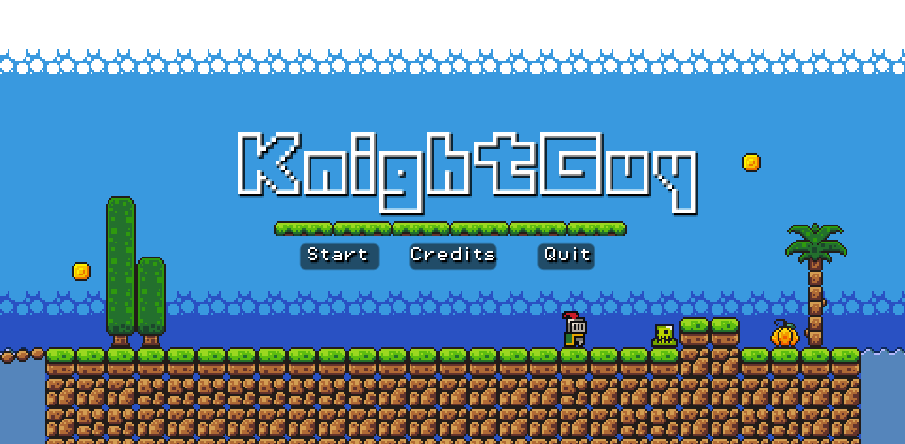

# KnightGuy

This is the repository which holds assets, scripts and other files for my first attempt at using the Godot engine. I am following along a [Brackeys tutorial](https://www.youtube.com/watch?v=LOhfqjmasi0) and putting my own spin on it, testing some stuff and defining my flow for working with Godot. The result of this experimenting is this game I have dubbed "KnightGuy". 

The idea was for me to design a little 'game' whilst learning the basics of the Godot engine. Additionally, I could also learn a bit more about CI/CD using GitHub Actions and how tagging and releases work. A great learning experience!

## Premise

Currently, the game flow is still under development. The basic idea is that of a platformer, in which you take up the mantle of KnightGuy.

## Automation

In learning the Godot engine, I also wanted to learn how to automate the building of my game. Currently, the following system is in place:

I use a GitHub Actions workflow that builds the game on 3 platforms: 

- Windows build
- Linux build
- Web-based build

The Linux and Windows builds can be downloaded from the artifacts of the GitHub workflow, provided you have a GitHub account. I will look into making releases on my GitHub page once I have something tangible so that people can download the builds from there as well.

For the web-based build, I deploy this using GitHub Actions and GitHub Pages. When the workflow runs, the web-based build gets hosted using GitHub pages and can also be visited using my own domain name. This and some other magic is all included in the workflow, so provided I don't break the game itself, it should almost always be playable on the [URL](https://knightguy.alexanderveldeman.be/) provided within the repository

## Credits

I would like to thank the following people:

Brackeys - for providing an in-depth beginnner tutorial and the baseline assets for this project

Cainos - for providing great assets 

<!-- Playtesters: -->